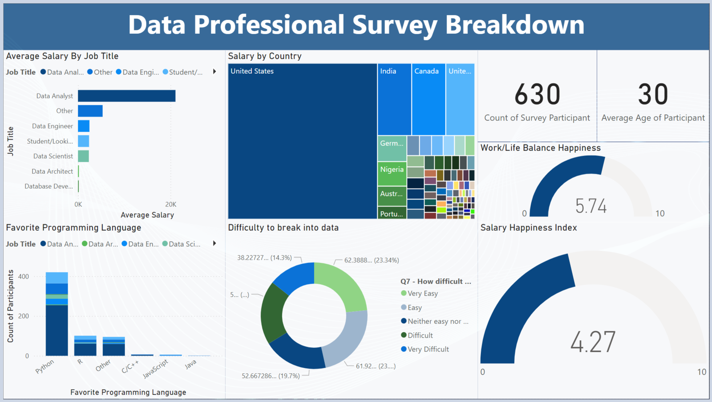

# Data Professional Survey Dashboard

## Problem Statement: 
The data industry lacks comprehensive insights into professional demographics, compensation trends, and workforce satisfaction metrics. This gap in understanding makes it challenging for organizations to make informed decisions about hiring, retention, and industry competitiveness.

##  Project Goal: 
To create an interactive dashboard that visualizes key metrics from a data professional survey, providing actionable insights about industry trends, salary distributions, and workforce satisfaction levels.

## Deliverable: 
A Power BI dashboard that presents:
- Salary distribution across different data roles
- Geographic salary variations
- Programming language preferences
- Industry entry barriers
- Workforce satisfaction metrics
- Demographic information

## Technical Implementation
My final dashboard is in [datasets/professional survey.pbix](datasets/professional survey.pbix)
- **Data Visualization Tool**: Power BI
- **Key Visualizations**:
  - Bar charts for salary and programming language analysis
  - Donut chart for difficulty assessment
  - Gauge charts for satisfaction metrics
  - Geographic heat map for salary distribution
- **Color Scheme**: Professional blue palette maintaining consistency across visualizations
- **Interactive Elements**: Cross-filtering capabilities and dynamic tooltips

## Key Features Implemented
1. Multi-metric Overview Panel
   - Survey participant count (630)
   - Average age of participants (30)
   - Work-life balance score (5.74/10)
   - Salary satisfaction index (4.27/10)

2. Comparative Analysis Tools
   - Job title salary benchmarking
   - Country-wise salary comparison
   - Programming language popularity metrics

3. Entry Barrier Assessment
   - Percentage breakdown of difficulty levels
   - Visual representation of industry accessibility

## Key Insights Generated
1. Workforce Demographics
   - Data Analyst is the most common role
   - Young workforce with average age of 30
   - Significant international representation

2. Technical Preferences
   - Python dominates as the preferred programming language
   - Clear hierarchy in technology adoption rates

3. Industry Accessibility
   - 23.34% find entry relatively easy
   - 37.67% report difficulty entering the field
   - Mixed experiences suggest varying entry paths

4. Satisfaction Metrics
   - Moderate work-life balance satisfaction (5.74/10)
   - Lower salary satisfaction (4.27/10)
   - Potential retention risk indicators

## Business Impact
1. Recruitment Strategy Enhancement
   - Informed salary benchmarking for competitive offers
   - Understanding of required technical skills
   - Insights into geographical salary variations

2. Retention Planning
   - Identification of satisfaction pain points
   - Work-life balance considerations
   - Compensation strategy alignment

3. Industry Positioning
   - Clear understanding of market competition
   - Entry barrier awareness for training programs
   - Technology stack prioritization

4. Resource Allocation
   - Training program development
   - Compensation structure optimization
   - Geographic expansion planning