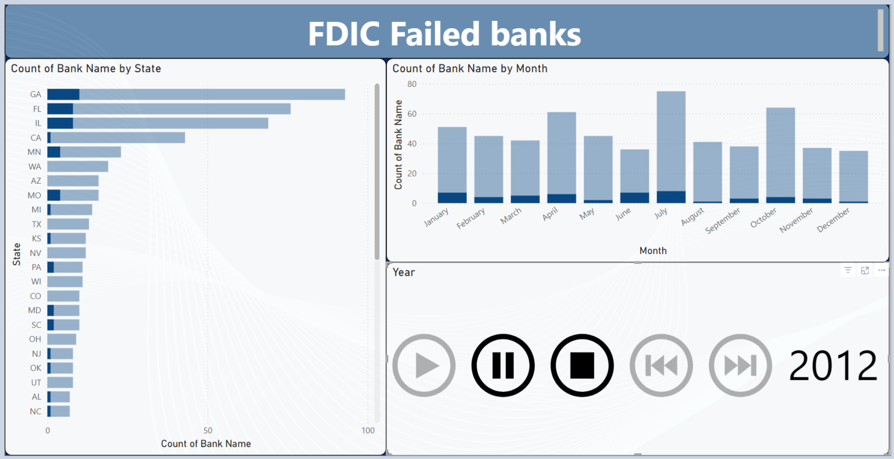

# FDIC Failed Banks Analysis Dashboard

## Problem Statement: 
Tracking and analyzing bank failures across different states and time periods is crucial for understanding financial sector stability. Without proper visualization and analysis, it's challenging to identify patterns and potential risk areas in the banking system.

## Project Goal
To create an interactive visualization dashboard that tracks and analyzes FDIC bank failures across the United States, enabling stakeholders to identify geographical and temporal patterns in bank failures during 2012.

## Expected Deliverable
A Power BI dashboard that provides:
- Geographic distribution of bank failures by state
- Monthly trend analysis of bank failures
- Interactive time controls for dynamic data exploration
- Clear visualization of failure patterns

## Technical Implementation
My final dashboard is in [datasets/fdic_failed_banks.pbix](datasets/fdic_failed_banks.pbix)
- **Platform**: Power BI
- **Data Source**: FDIC Failed Banks Database
- **Visualization Types**:
  - Horizontal bar chart for state-wise analysis
  - Column chart for monthly trends
  - Interactive timeline controls
- **Color Scheme**: Professional blue gradient with dark accents
- **Interactive Elements**: Play/pause, forward/backward controls for time-based analysis

## Key Features Implemented
1. Geographic Analysis Panel
   - State-wise bank failure counts
   - Color-coded bars for easy comparison
   - Sorted display for quick ranking identification

2. Temporal Analysis Components
   - Monthly distribution view
   - Interactive timeline controls
   - Year-specific data isolation (2012)

3. User Interface Elements
   - Intuitive navigation controls
   - Clear data labels
   - Consistent visual hierarchy

## Key Insights Generated
1. Geographic Concentrations
   - Georgia (GA) shows highest number of bank failures
   - Florida (FL) and Illinois (IL) follow as second and third most affected states
   - Notable concentration in southeastern United States

2. Temporal Patterns
   - July shows peak in bank failures
   - Irregular distribution throughout the year
   - October shows second highest concentration

3. Regional Trends
   - Higher failure rates in larger states
   - Significant impact in both coastal and inland states
   - Clear geographic clustering of failures

## Business Impact

1. Risk Assessment
   - Identification of high-risk geographical areas
   - Understanding of temporal failure patterns
   - Better preparation for potential banking crises

2. Regulatory Insights
   - Evidence-based policy making support
   - Resource allocation for bank supervision
   - Enhanced monitoring of at-risk regions

3. Stakeholder Communication
   - Clear visualization for regulatory reporting
   - Enhanced investor communications
   - Public awareness and transparency