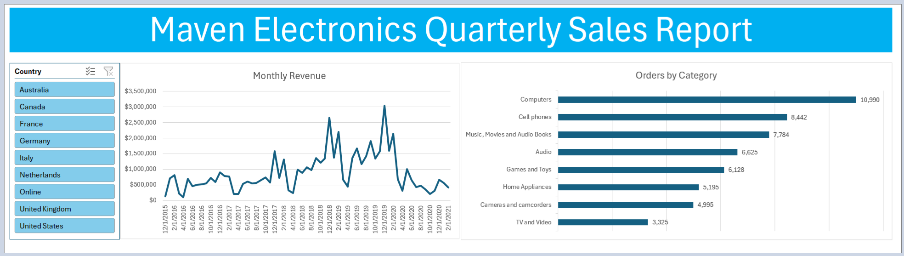

# Coffee Sales Dashboard

## Problem Statement: 
The project involves analyzing sales data for Maven Electronics to understand revenue trends across various product categories over multiple years. The goal is to identify patterns in sales performance and to determine which categories are driving revenue, thus informing business decisions.

##  Project Goal: 
The primary objective is to create a comprehensive dashboard that visualizes quarterly sales data, allowing stakeholders to easily interpret sales performance and make informed decisions regarding inventory, marketing strategies, and resource allocation.

## Key Skills Used: 
The project utilized several key skills, including:
- Data Visualization: Creating charts and graphs to represent sales data effectively.
- Excel Functions: Implementing formulas for calculations and data analysis.
- Dashboard Design: Structuring the dashboard for user-friendly navigation and insights.

## Deliverable: 
The main deliverable is a visually appealing and interactive sales dashboard that summarizes quarterly sales performance, showcasing total revenue and orders by product category over time. This dashboard serves as a decision-making tool for management