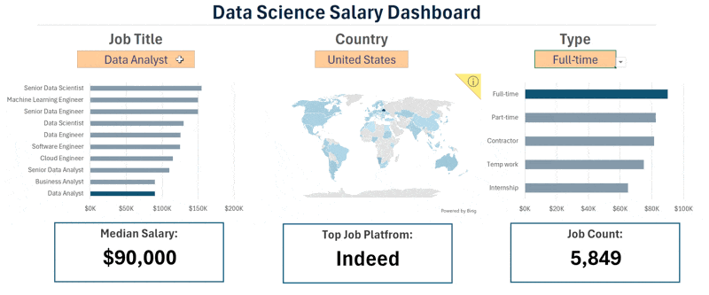

# Excel Salary Dashboard

## Problem Statement

Many Job seekers faces challenges understanding and evaluating salaries for various data-related job titles. Additionally, many lack insights to well compensated jobs based on their roles, skills, and locations. 

## Project Goal
The goal is to create an interactive Excel Salary Dashboard that enables users to analyze salary trends across different job titles, locations, and required skills. This tool aims to empower users with data-driven insights for informed career decisions.

## Excel Skills Used

The following Excel skills were utilized for analysis:

- **📉 Charts**: For visual representation of salary data.
- **🧮 Formulas and Functions**: To calculate median salaries and filter data effectively.
- **❎ Data Validation** : To ensure accurate user input and enhance usability.

## Deliverable
The final deliverable is an interactive Excel dashboard that presents:
- A bar chart comparing median salaries by job title.
- A map chart illustrating median salaries globally.
- A table displaying median salary information tailored by job title, country, and schedule type.

This dashboard serves as a comprehensive tool for job seekers to explore salary trends and make informed career decisions
